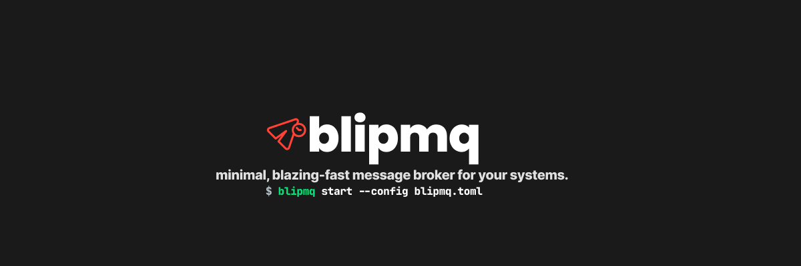

  

  <b>BlipMQ</b> is an ultra-lightweight, fault-tolerant message queue written in Rust — built for edge, embedded, and developer-first environments.

  ⚡ <i>“Kafka-level durability. MQTT-level simplicity. NATS-level performance — all in one binary.”</i>

## 📢 Follow Us

  
  
  
  

---

## 🧹 Features — `v1.0.0`

✅ = Implemented in `v1.0.0`
⬜ = Planned for future

### 🔌 Core Broker

* ✅ Single static binary (no runtime deps)
* ✅ TCP-based protobuf protocol
* ✅ Topic-based publish/subscribe
* ✅ QoS 0 delivery
* ⬜ QoS 1 support
* ✅ Per-subscriber isolated in-memory queues
* ✅ Configurable TTL and max queue size
* ✅ Overflow policies: `drop_oldest`, `drop_new`, `block`

### 🔐 Durability & Safety

* ✅ Append-only Write-Ahead Log (WAL)
* ✅ WAL segmentation (rotated files)
* ✅ Replay unacknowledged messages on restart
* ✅ CRC32 checksum for corruption detection
* ✅ Batched WAL flushing with fsync

### 📈 Observability

* ✅ Prometheus `/metrics` endpoint
* ✅ Tracing + structured logs
* ✅ Connection + delivery stats

### 🧰 Operational Controls

* ✅ Configurable limits (connections, queue depth)
* ✅ API-key based authentication

---

## 💡 Ideal Use Cases

| Scenario                              | Why BlipMQ?                                                                 |
|---------------------------------------|-----------------------------------------------------------------------------|
| 🚁 **IoT or Edge Gateways**           | Single-binary broker with ultra-low latency and no heavy runtime overhead   |
| 🧪 **Local Testing/Dev Environments** | Embedded broker with fast crash recovery and zero-setup simplicity          |
| ⚙️ **Internal Microservice Bus**      | In-process message bus with no ops burden and blazing-fast pub/sub          |
| 🧱 **CI/CD Pipelines**                | Durable and high-speed event ingestion for test runners or deployments      |
| 📜 **Lightweight Log Ingestion**      | Fire-and-forget logging with fan-out support and minimal latency            |
| 📊 **Metrics and Telemetry Streams**  | Real-time time-series ingestion with optional per-subscriber filtering      |
| 💬 **Real-Time Chat Infrastructure**  | Ordered QoS 0 messaging with low latency, ideal for user/topic message flow |
| 🕹️ **Multiplayer Game Messaging**    | Per-player queues with optional reliability and sub-ms delivery             |
| 📦 **Local Job Queues**               | Drop-in replacement for Redis queues with retry and durability options      |
| 🧠 **Distributed Cache Invalidation** | High-speed fan-out to multiple replicas or edge caches                      |
| 🪄 **Feature Flag Propagation**       | Push config and toggles without polling                                     |
| 🔌 **Serverless & WASM Runtimes**     | Runs inside Wasm or serverless apps due to its Rust-native, no-deps design  |
| 📡 **Offline-First Apps**             | Queue and sync later with pluggable durability and buffering                |
| 🎮 **In-Process Game/Sim Engines**    | Internal coordination across subsystems (AI, UI, Physics)                   |
| 🧬 **Model Serving / Hot Reload**     | Real-time model or config updates to downstream ML inference nodes          |
| 🧯 **Alert Fan-out (Security/Ops)**   | Instantly notify multiple alerting sinks from a single producer             |
| 🧰 **Embedded/Edge Command Systems**  | Low memory, high-speed messaging for control signals                        |
| 🔄 **Change Data Capture (CDC)**      | Real-time DB change fan-out with replay capability                          |
| 📤 **Webhook / Event Fan-out**        | Ingest events and deliver to many consumer systems/webhooks                 |
| 🦡 **Frontend WebSocket Fan-out**     | Backend-to-browser pub/sub with per-topic filtering                         |

---

## 🚀 When to Pick BlipMQ?

| If you need…                        | Why BlipMQ is ideal                                                   |
|-------------------------------------|-----------------------------------------------------------------------|
| 🩾 Minimal resource usage           | Binary < 5MB, no JVM, GC, or heavy dependencies                       |
| ⚡ Ultra-low latency                 | Sub-millisecond paths with in-process and lock-free delivery          |
| 🧰 Simple deployment                | No infrastructure, just `cargo add blipmq` or run a single binary     |
| 🔄 Pluggable QoS                    | Choose between fire-and-forget (QoS 0) or guaranteed (QoS 1) delivery |
| 💬 Per-subscriber queues            | Each subscriber gets its own delivery queue                           |
| 🪶 Lightweight alternative to Kafka | When Kafka or NATS is overkill for internal or local communication    |
| 🧠 Full internal control            | Built for embedding, hacking, and customizing from your app           |

---

> 📄 Licensed under BSD-3-Clause — see [LICENSE](./LICENSE)
